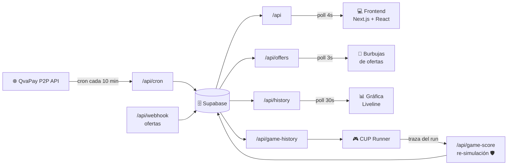

<div align="center">


# CambioCUP

**La tasa de cambio del dólar en Cuba, en tiempo real.**

[](https://www.cambiocup.com)
[](https://www.cambiocup.com/play)

[](https://nextjs.org/)
[](https://react.dev/)
[](https://supabase.com/)
[](https://tailwindcss.com/)
[](https://vercel.com/)

<br/>

<a href="https://www.cambiocup.com">
  
</a>

<sub>⚡ Esta imagen no es una captura: se genera <strong>en vivo</strong> desde <a href="https://www.cambiocup.com/api/og?coin=CUP"><code>/api/og</code></a> con la tasa y la tendencia de este preciso momento.</sub>

</div>

---

## ¿Qué es?

**CambioCUP** es un servicio gratuito desarrollado por [QvaPay](https://qvapay.com) que monitorea las tasas de cambio del mercado informal cubano frente al dólar estadounidense. Los datos salen de operaciones P2P reales, se actualizan cada 10 minutos y la interfaz los anima como un ticker bursátil: números fluidos, gráfica de fondo en vivo y colores que cuentan la tendencia de un vistazo.

| | Moneda | Descripción | Decimales |
|---|---|---|---|
| 🇨🇺 | **CUP** | Peso cubano | 2 |
| 💳 | **MLC** | Moneda Libremente Convertible | 3 |
| 🏦 | **CLÁSICA** | Tarjeta Clásica | 3 |
| 📱 | **ETECSA** | Saldo móvil ETECSA | 2 |
| 🌴 | **TROPICAL** | BANDEC Prepago | 2 |
| ⛽ | **GAS** | Gasolina (USD por litro) | 2 |

## ✨ Características

- **📈 Tiempo real** — la interfaz se refresca cada 4 segundos con micro-fluctuaciones que reflejan el pulso del mercado
- **🟢🔴 Semáforo de tendencia** — verde cuando la tasa está por debajo del promedio reciente, rojo cuando está por encima
- **📊 Gráfica viva de fondo** — 15 días de historia renderizados a pantalla completa detrás del precio
- **💬 Ofertas flotantes** — las compras y ventas reales aparecen como burbujas animadas según ocurren
- **🔔 Notificaciones push** — vía OneSignal
- **🪟 Widget embebible** — un iframe para llevar la tasa a cualquier web
- **🧊 Liquid Glass UI** — lente de vidrio con mapa de desplazamiento SVG, al estilo iOS
- **🎮 CUP Runner** — un juego de correr construido sobre la historia real de la tasa (sigue leyendo 👇)

## 🎮 CUP Runner

<div align="center">
  <a href="https://www.cambiocup.com/play">
    
  </a>
</div>

<br/>

El terreno del juego **es la gráfica histórica del CUP**: cada subida fuerte de la tasa es un pico rojo mortal, cada caída es un hueco. Las ofertas de compraventa que ocurren *mientras juegas* caen al mapa como eventos de dificultad en vivo. Aprenderse la historia del dólar en Cuba es, literalmente, la habilidad del juego.

Y el leaderboard se defiende solo:

> 🛡️ **Anti-cheat por re-simulación** — el cliente no envía un puntaje: envía la **traza completa de inputs** del run (saltos, ofertas, resizes, indexados por paso de física). El servidor reconstruye el mapa exacto que vio el jugador y **re-ejecuta la simulación determinista completa** con el mismo motor de física (120 Hz, aritmética IEEE-754 exacta). Si el puntaje no se reproduce bit a bit, el run cae en un honeypot: se guarda marcado, recibe un ranking creíble de vuelta… y jamás aparece en la tabla. El tramposo cree que funcionó y deja de escarbar. 🍯

## 🏗️ Arquitectura



1. Un **cron de Vercel** consulta QvaPay cada 10 minutos y guarda `(promedio_compra + promedio_venta) / 2` por moneda
2. **Supabase** (PostgreSQL) almacena el historial completo, en modo append-only
3. El **frontend** sondea la API cada 4 segundos y anima cada cambio con [NumberFlow](https://number-flow.barvian.me/)
4. Las **imágenes OG** se generan al vuelo con la tasa del momento — por eso este README siempre está actualizado

<details>
<summary><strong>📡 Endpoints de la API</strong></summary>

<br/>

| Endpoint | Método | Descripción |
|---|---|---|
| `/api` | GET | Últimas 6 entradas por moneda |
| `/api/cron` | GET | Ingesta desde QvaPay (cron cada 10 min) |
| `/api/offers` | GET | Ofertas de los últimos 2 minutos |
| `/api/history?coin=CUP&days=7` | GET | Serie histórica para gráficas |
| `/api/game-history?coin=CUP` | GET | Historia completa bucketizada para el terreno del juego |
| `/api/game-token` | GET | Token HMAC firmado que abre un run (anti-cheat) |
| `/api/game-score` | GET / POST | Leaderboard / envío de run verificado por re-simulación |
| `/api/og?coin=CUP` | GET | Imagen Open Graph en vivo (1200×630) |
| `/api/og/play` | GET | Tarjeta OG del juego con el terreno real del CUP |
| `/api/webhook` | POST | Recibe nuevas ofertas de compraventa |

</details>

<details>
<summary><strong>🗄️ Esquema de base de datos</strong></summary>

<br/>

**`exchange`** — historial de tasas (append-only)

- `coin_id` · 1=CUP, 2=MLC, 3=CLASICA, 4=ETECSA, 5=TROPICAL, 6=GAS
- `value`, `updated_at`

**`offers`** — operaciones de compraventa

- `type` (`buy`|`sell`), `status`, `value`, `coin`, `created_at`

**`game_scores`** — leaderboard de CUP Runner

- `name` (usuario de Telegram), `score`, `day`, `flagged` (honeypot 🍯), `nonce` (tokens de un solo uso)

</details>

## 🚀 Instalación

```bash
git clone https://github.com/n3omaster/cambiocup.git
cd cambiocup
npm install
```

Crea un archivo `.env`:

```bash
SUPABASE_URL=tu_url_de_supabase
SUPABASE_KEY=tu_clave_de_supabase
# opcional: secreto independiente para los tokens del juego
GAME_SCORE_SECRET=un_secreto_largo
```

```bash
npm run dev      # desarrollo (Turbopack)
npm run build    # build de producción
npm run start    # servidor de producción
npm run lint     # ESLint
```

> Requiere Node.js 20+ y una cuenta de [Supabase](https://supabase.com). Optimizado para desplegarse en [Vercel](https://vercel.com) (el cron se define en `vercel.ts`).

## 🤝 Contribuir

1. Haz fork del proyecto
2. Crea una rama (`git checkout -b feature/NuevaFuncion`)
3. Haz commit (`git commit -m 'Add NuevaFuncion'`)
4. Push (`git push origin feature/NuevaFuncion`)
5. Abre un Pull Request

---

<div align="center">

Hecho con 💚 por **[Erich García Cruz](https://github.com/n3omaster)** · Un servicio gratuito de **[QvaPay](https://qvapay.com)**

[🌐 cambiocup.com](https://www.cambiocup.com) · [🎮 Jugar CUP Runner](https://www.cambiocup.com/play) · [🏆 Records](https://www.cambiocup.com/play/top-scores) · [𝕏 @qvapay](https://x.com/qvapay)

</div>
